<!-- Encabezado de la Terminal Animada -->

  

<!-- Separador en Degradado Animado -->

  

<!-- Grid de Estadísticas en vivo de GitHub -->
## 📊 Métricas y Actividad de GitHub

<table align="center">
  <tr>
    <td align="center" width="50%">
      
    </td>
    <td align="center" width="50%">
      
    </td>
  </tr>
</table>

 

<!-- Separador en Degradado Animado -->

  

<!-- Footer y Contador de Visitas -->

  
    
  Diseño mejorado • Full Stack Junior en constante mejora • 2026

